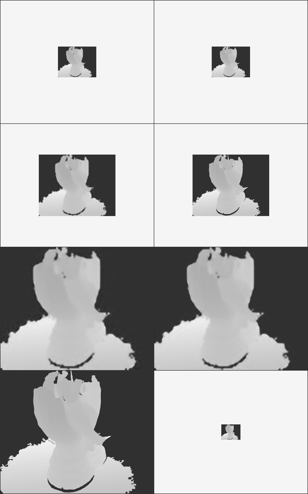

# DSDMSR PyTorch
-----------------------------------------------------------------------------------------

This is a PyTorch Implementation of Deeply Supervised Depth Map Super Resolution as Novel View Synthesis (https://arxiv.org/abs/1808.08688).

## Network Architecture:


## Instructions to run the training process:

1) Download the DTU dataset at a specific location (Example: "/users/asrimanth/DTU")
2) Install Python packages argparse, tqdm, numpy, pandas, matplotlib, Pillow, OpenCV, PyTorch, torchvision and wandb.
3) Create a project in wandb (__your-project-name__), and change the project name in the train_dtu_vdsr.py file to __your-project-name__ and change your username to __your_username__.
4) Run the files in the following order:

```
python3 dtu_patcher.py --SOURCE-DIR "/users/asrimanth/DTU" --DEST-DIR "/users/asrimanth/DTU_patches"

python3 dtu_indexer.py --SOURCE-DIR "/users/asrimanth/DTU_patches"

python3 train_dtu_vdsr.py --train-file "train_dtu.csv" --eval_file "valid_dtu.csv" --outputs-dir "./models"
```
The first command downsamples the DTU images to 64x80, 128x160, 256x320, 512x640 and 1024x1280.

The second command indexes the downsampled folder to create a .csv indexed file.

The third command starts training on the data, using the DCNN unit as VDSR Net. If there is not enough compute power available, please run train_dtu.py instead of train_dtu_vdsr.py, since the former uses SRCNN as the DCNN unit, which is significantly less computationally expensive.

## Experimental Results on Validation set:
Image legend: (Pred => Prediction, GT => Ground Truth, MSF => Multi-Scale Fusion, as proposed in the paper).
Top Left: x128 Pred, Top Right: x128 GT, 2nd row Left: x256 Pred, 2nd row Right: x256 GT, 3rd row Left: x512 Pred, 3rd row Right: x512 MSF, Last row Left: x512 GT, Last row Right: x64 Input.

| Example 0                                      | Example 1                                      | Example 2                                      | Example 3                                      | Example 4                                      | Example 5                                      |
|------------------------------------------------|------------------------------------------------|------------------------------------------------|------------------------------------------------|------------------------------------------------|------------------------------------------------|
| At index : 860.                                | At index : 1095.                               | At index : 1126.                               | At index : 1130.                               | At index : 1294.                               | At index : 1459.                               |
|  |  |  |  |  |  |

# Credits

### Deeply Supervised Depth Map Super-Resolution as Novel View Synthesis.
**Xibin Song, Yuchao Dai, and Xueying Qin**

Abstract
Deep convolutional neural network (DCNN) has been successfully applied to depth map super-resolution and outperforms existing methods by a wide margin. However, there still exist two major issues with these DCNN based depth map super-resolution methods that hinder the performance: i) The low-resolution depth maps either need to be up-sampled before feeding into the network or substantial deconvolution has to be used; and ii) The supervision (high-resolution depth maps) is only applied at the end of the network, thus it is difficult to handle large up-sampling factors, such as  8; 16. In this paper, we propose a new framework to tackle the above problems. First, we propose to represent the task of depth map super-resolution as a series of novel view synthesis sub-tasks. The novel view synthesis sub-task aims at generating (synthesizing) a depth map from different camera pose, which could be learned in parallel. Second, to handle large up-sampling factors, we present a deeply supervised network structure to enforce strong supervision in each stage of the network. Third, a multi-scale fusion strategy is proposed to effectively exploit the feature maps at different scales and handle the blocking effect. In this way, our proposed framework could deal with challenging depth map super-resolution efficiently under large up-sampling factors (e.g. 8; 16). Our method only uses the low-resolution depth map as input, and the support of color image is not needed, which greatly reduces the restriction of our method. Extensive experiments on various benchmarking datasets demonstrate the superiority of our method over current state-of-the-art depth map super-resolution methods.

arXiv Source: [arXiv](https://arxiv.org/abs/1808.08688) \
Actual Paper: [Paper](https://arxiv.org/pdf/1808.08688.pdf)
